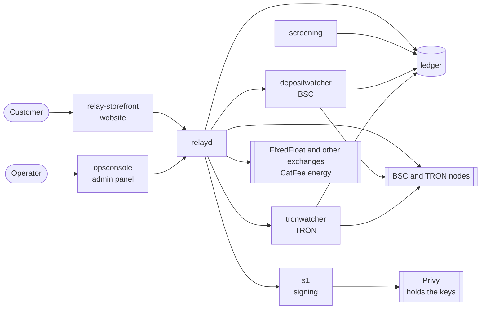

# How it works

This describes the system as it runs today (Model F, the relay). What it must
do is set by [00-product-goals.md](00-product-goals.md); this document explains
how the code does it.

## The idea

We don't hold our own stock of USDT on either network. Each customer order is
relayed: the customer pays into one of our deposit wallets, we keep our fee,
and we forward the rest to an exchange partner (FixedFloat) that pays the
customer on the other network. Our job is everything around the exchange:
pricing, wallets, network fees, signing, checking the payout, collecting
profit, and keeping records.

## The services

| Service | Default port | Job |
|---|---|---|
| `relayd` | 18187 | The core. Public API for quotes and orders; admin API; a loop that moves every open order forward. |
| `depositwatcher` | 18188 | Watches BSC for USDT deposits; leases BSC deposit wallets to orders. |
| `tronwatcher` | 18186 | The same for TRON. |
| `ledger` | 18180 | Double-entry ledger; every order and every movement of money is recorded here. |
| `screening` | 18189 | Checks each order before money moves. Today a placeholder approves everything. |
| `s1` | 18185 | Signs transactions. In production the keys are in Privy; S1 asks Privy to sign. |
| `opsconsole` | 18190 | Admin panel. |
| `relay-storefront` | 5181 | The customer website (React). |

Each service has its own PostgreSQL database.

## An order, step by step

Example: a customer sends 100 USDT on BSC and receives USDT on TRON.

1. **Quote.** The storefront asks relayd for a price. relayd asks the exchange
   partner(s) for a rate, adds our margin (set by an admin, per direction), and
   returns: 100 in, exchange fee, our fee, amount out. Nothing is stored yet.
2. **Order.** The customer confirms. relayd records the order in the ledger and
   asks `depositwatcher` for a deposit wallet from the BSC pool. The customer
   has 30 minutes to pay into it.
3. **Deposit.** `depositwatcher` sees the USDT transfer, waits until the block
   is final, and reports it to the ledger. relayd works with the amount that
   actually arrived, not the amount quoted.
4. **Screening.** `screening` checks the order. A held order waits for an
   operator; a rejected one is refunded.
5. **Exchange order.** relayd opens an order with the exchange: USDT on BSC in,
   USDT on TRON out, paid to the customer's wallet.
6. **Network fees.** The deposit wallet needs BNB to send USDT. If it has too
   little, relayd sends the exact shortfall from the treasury and waits for it
   to arrive.
7. **Forward.** relayd builds the transfer (deposit minus our profit) to the
   exchange's deposit address, S1 signs it, and relayd broadcasts it and waits
   for confirmation.
8. **Payout check.** The exchange converts and pays the customer on TRON.
   relayd reads the payout transaction from the chain and checks that the USDT
   really reached the customer's address before marking the order `SETTLED`.
9. **Profit.** Our fee stays in the deposit wallet. The wallet cools down and
   goes back to the pool; a periodic sweep later moves collected profit to the
   treasury.

**The other direction** (send on TRON, receive on BSC) differs only at step 6.
A TRON wallet must be activated once (the treasury sends it a little TRX,
about 1.1 TRX in total), and sending USDT on TRON needs energy: relayd works
out exactly how much this transfer needs (about 65,000, or about 130,000 if the
receiving address has never held USDT) and rents that much from CatFee.

Order states: `AWAITING_DEPOSIT` → `FORWARDING` → `FORWARDED` → `SETTLED`,
plus `EXPIRED` (never paid), `REFUND_PENDING`/`REFUNDED`, `FAILED`, and
`UNRECOVERABLE` (money left us but the exchange failed; an operator must act).

## Money and prices

- **Customer price:** amount in − exchange fee − our fee = amount out. The
  customer sees this before paying.
- **Our fee:** a percentage with a minimum, set per direction in the admin
  panel (Pricing).
- **Our costs** (BNB top-ups, TRON activation, energy rental) are paid from the
  treasury and recorded against each order. They are not shown to the
  customer, so the margin has to cover them; TRON → BSC orders cost the most.
- **Order limits:** a minimum and maximum amount, also in Pricing.

## Wallets

| Wallet | Owner | Role |
|---|---|---|
| Customer's sending wallet | customer | pays into our deposit wallet |
| **Deposit wallet** | us | receives the deposit, forwards it, keeps our fee until swept |
| **Treasury** | us | pays deposit wallets' network fees; receives swept profit |
| Exchange deposit address | exchange | a new one per order |
| Customer's receiving wallet | customer | receives the payout from the exchange |

**The deposit-wallet pool** (one per network) keeps the number of wallets
small, because every wallet in use costs money: its own top-ups, its own
sweeps, and on TRON its own activation. The rules:

- A new wallet is created only when every existing one is busy: serving an
  order, or cooling down after one.
- Among free wallets, one that has received a deposit before is chosen first.
- Each pool has a maximum (10 by default). When all are busy, new orders are
  asked to try again in a few minutes.
- After an order a wallet cools down (30 minutes; 6 hours if the order expired
  unpaid, since that customer may still pay late), so a late payment is never
  credited to the next customer.

**The treasury** is one key with an address on each network. Several
treasuries can be configured; a top-up comes from one that can pay for it.

**Sweeps** move profit from idle deposit wallets to the treasury: only profit
from settled orders, only above a minimum per network, on an interval. They
are off until an admin turns them on (Sweeps page).

## Keys and signing

- **Where keys live.** In production every private key (treasury and deposit
  wallets) is held by Privy. S1 keeps only references to them. A local setup
  uses keys generated on your machine instead.
- **Signing.** relayd builds the complete transaction, reduces it to a 32-byte
  hash, and sends that to S1. S1 asks Privy to sign the hash and returns the
  signature.
- **Sending.** relayd attaches the signature and broadcasts the transaction
  itself, through public BSC and TRON nodes. Privy never sees a transaction,
  so its dashboard shows no transactions; look up the wallet address on
  BscScan or TronScan instead.
- **Approvals.** S1 holds back any signature worth more than
  `S1_APPROVAL_THRESHOLD_USD` until an approver signs off.

## What protects the money

- **Every transfer is journaled before it is signed** (`transfer_attempts`:
  built → signed → broadcast → confirmed). After a crash or restart relayd
  resumes the same transaction instead of sending a second one.
- **Checks before signing:** the sender, amount and recipient must match what
  the order expects; balances are read first, and a shortfall raises an alert
  instead of sending.
- **Payout verification:** an order is only marked settled after the payout is
  found on-chain; a short or missing payout raises an alert.
- **No early expiry:** an unpaid order is not expired while the watcher is
  behind or still confirming a deposit, so a late-detected payment isn't lost.
- **Exchange order renewal:** if the exchange's order expires before anything
  was sent, relayd opens a new one instead of sending to a stale address.
- **Refunds** return the deposit to the sender when an order can't go ahead.
- **Alerts** are log lines today (`relay_leg_*` messages); sending them to
  Telegram or email is on the roadmap.

## Vendors

- **Conversion:** FixedFloat (tested with real money), ChangeNOW and SideShift
  (built, not yet tested live). An admin chooses how to pick among them (best
  rate, best margin, cheapest, or fixed priority), can switch any vendor off,
  and records each vendor's revenue share.
- **Failover:** a vendor that fails is taken out of rotation for a while, and
  the order is priced with the others.
- **TRON energy:** CatFee (tested with real money).

## Records and administration

- The ledger holds a double-entry record of every order.
- relayd keeps, per order: deposit, sender, profit, amount forwarded, exchange
  fee, payout transaction, and each network-fee cost.
- The admin panel (`opsconsole`) opens on an overview of what needs attention
  (orders stuck or failed, late payments, low treasury or CatFee balances, an
  exchange out of rotation, a watcher behind the chain, a service down) and the
  day's numbers. It also has every order with a step-by-step story and
  blockchain links, unmatched deposits to refund, pricing with a live price
  check, vendors, both wallet pools, treasury and profit with sweeps, screening
  holds, signing approvals, system health with an emergency stop, and an audit
  log of every change made there.

## Where it runs

The live system currently runs on the operator's own computer. Before real
customers it needs a server, automatic backups and alerts; see the
[roadmap](03-build/model-f-production-mvp-roadmap.md). The earlier Model D
services in this repository (`dispatcher`, `energybroker`, `gateway`,
`storefront`) are not part of it.
